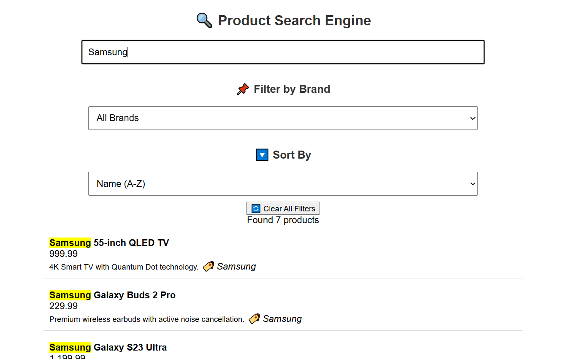

# Product Search Engine

A simple and efficient **Product Search Engine** built with PHP, JavaScript, and MySQL. This project allows users to search for products dynamically with filtering and sorting capabilities.

---

## 📌 Key Features
- **Live Search**: Instantly search for products in real-time.
- **Filtering & Sorting**: Filter by brand and sort results dynamically.
- **Database Integration**: Fetch data from MySQL using PHP.
- **Responsive UI**: Modern, user-friendly interface with CSS.

---

## 📷 Output Screenshot
 

---

## 📦 Dependencies
- PHP 7.x or higher
- MySQL Database
- Apache Server (XAMPP, WAMP, or MAMP)
- JavaScript (Vanilla JS)

---

## 📂 Project Structure
```
Product-Search-Engine/
│── database.sql           # Database schema
│── db_connect.php         # Database connection script
│── fetch_results.php      # Fetches search results dynamically
│── search.php             # Backend search logic
│── script.js              # JavaScript for live search and filters
│── style.css              # CSS for styling the UI
│── screenshot.png         # Project screenshot (Add this file)
│── .gitignore             # Excludes unnecessary files (optional)
│── README.md              # Project documentation
```

---

## 🛠 Installation
### 1️⃣ Clone the Repository
```sh
git clone https://github.com/beingdhruvv/Product-Search-Engine.git
cd Product-Search-Engine
```

### 2️⃣ Set Up the Database
1. Create a MySQL database.
2. Import `database.sql` into your database.
3. Update `db_connect.php` with your database credentials.

### 3️⃣ Run the Project
- Ensure you have a local server (XAMPP, WAMP, or MAMP) running.
- Place the project folder inside the `htdocs` directory (or equivalent).
- Open `http://localhost/Product-Search-Engine/search.php` in your browser.

---

## 🖥 Usage
1. Enter a keyword in the search box.
2. Use filters and sorting options to refine results.
3. View search results dynamically updated.

---

## 📝 License
This project is licensed under the **MIT License**. Feel free to modify and use it.

---
