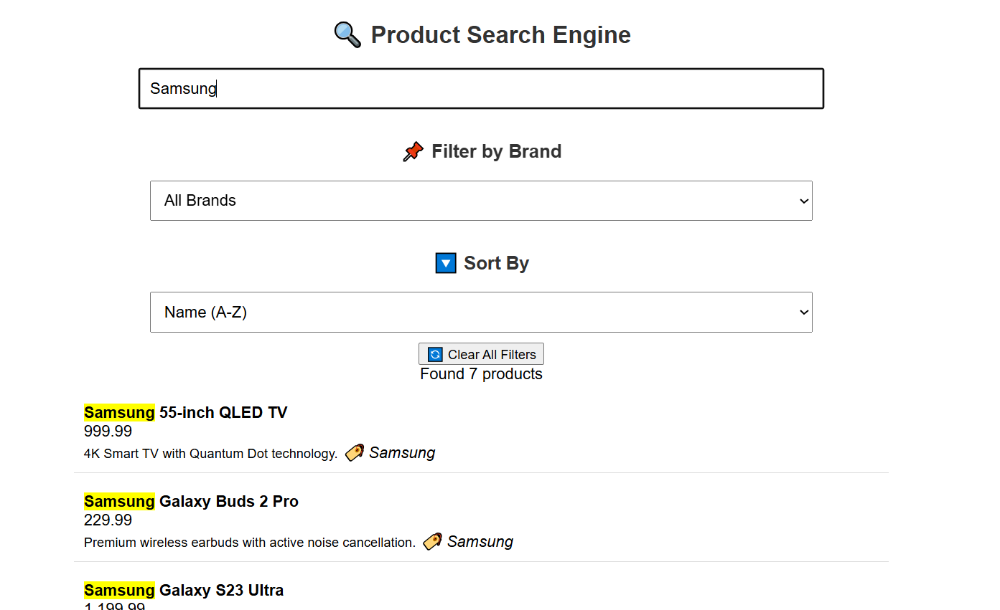

# Product Search Engine

> A dynamic and efficient **Product Search Engine** built with PHP, JavaScript, and MySQL. This project demonstrates real-time search functionality with filtering and sorting capabilities, perfect for understanding full-stack web development fundamentals.


---

## Table of Contents

- [About This Project](#about-this-project)
- [Key Features](#key-features)
- [Tech Stack](#tech-stack)
- [Screenshot](#screenshot)
- [Project Structure](#project-structure)
- [Installation](#installation)
- [Usage](#usage)
- [How It Works](#how-it-works)
- [File Descriptions](#file-descriptions)
- [Concepts Learned](#concepts-learned)
- [Troubleshooting](#troubleshooting)
- [Future Improvements](#future-improvements)
- [Contributors](#contributors)
- [Acknowledgments](#acknowledgments)
- [License](#license)
- [Contact](#contact)

---

## About This Project

This project was developed as part of our **Diploma in Computer Engineering** learning journey, in collaboration with my classmate **Hena Patel**. It serves as a **beginner-level project** designed to understand and practice fundamental concepts of:

- **PHP**: Server-side scripting, handling HTTP requests, and database interactions
- **MySQL**: Database design, SQL queries, and data management
- **AJAX/JavaScript**: Asynchronous data fetching and dynamic DOM manipulation
- **Full-stack Integration**: Connecting frontend and backend components

As a learning project, this implementation focuses on demonstrating core web development concepts rather than production-ready features. It's an excellent starting point for students and beginners who want to understand how PHP and MySQL work together to create dynamic web applications.

---

## Key Features

- **Live Search**: Instantly search for products in real-time with dynamic results
- **Filtering & Sorting**: Filter by brand and sort results dynamically by various criteria
- **Database Integration**: Seamless data fetching from MySQL using PHP
- **AJAX-Powered**: Asynchronous updates without page reload for smooth user experience
- **Responsive UI**: Modern, user-friendly interface with clean CSS styling
- **Real-time Updates**: Results update instantly as you type or change filters

---

## Tech Stack

| Component | Technology |
|-----------|------------|
| **Backend** | PHP 7.4+ |
| **Database** | MySQL 5.7+ |
| **Frontend** | HTML5, CSS3, Vanilla JavaScript |
| **API Communication** | AJAX (XMLHttpRequest/Fetch API) |
| **Server** | Apache (XAMPP/WAMP/MAMP) |

---

## Screenshot



---

## Project Structure

```
Product-Search-Engine/
│
├── database.sql           # Database schema and sample data
├── db_connect.php         # Database connection configuration
├── fetch_results.php      # Backend API endpoint for search queries
├── search.php             # Main frontend page with search interface
├── script.js              # Client-side JavaScript for AJAX and DOM manipulation
├── style.css              # Stylesheet for UI styling
├── screenshot.png         # Project demonstration screenshot
├── .gitignore            # Git ignore file (optional)
└── README.md             # Project documentation
```

---

## Installation

### Prerequisites

Before you begin, ensure you have the following installed:
- PHP 7.4 or higher
- MySQL 5.7 or higher
- Apache Server (XAMPP, WAMP, or MAMP)
- A modern web browser

### Step 1: Clone the Repository

```bash
git clone https://github.com/beingdhruvv/Product-Search-Engine.git
cd Product-Search-Engine
```

### Step 2: Set Up the Database

1. Open phpMyAdmin or your MySQL client
2. Create a new database (e.g., `product_search`)
3. Import the `database.sql` file into your database
4. Verify that the `products` table has been created with sample data

### Step 3: Configure Database Connection

Open `db_connect.php` and update the following credentials:

```php
$host = "localhost";
$username = "your_username";
$password = "your_password";
$database = "product_search";
```

### Step 4: Run the Project

1. Ensure your local server (XAMPP/WAMP/MAMP) is running
2. Place the project folder inside the `htdocs` directory (or equivalent)
3. Open your browser and navigate to:
   ```
   http://localhost/Product-Search-Engine/search.php
   ```

---

## Usage

1. **Search**: Type a product name or keyword in the search box
2. **Filter**: Use the brand filter dropdown to narrow down results
3. **Sort**: Select sorting options to organize results by price, name, etc.
4. **View Results**: Results update dynamically as you interact with the interface

---

## How It Works

The application follows a **client-server architecture** with clear separation of concerns:

### Architecture Overview

```
┌─────────────┐         ┌─────────────┐         ┌─────────────┐
│   Browser   │────────▶│  PHP Server │────────▶│   MySQL     │
│ (Frontend)  │◀────────│  (Backend)  │◀────────│  (Database) │
└─────────────┘         └─────────────┘         └─────────────┘
```

### Workflow

1. **User Input**: User types in the search box or selects filters
2. **JavaScript Capture**: Client-side JavaScript captures the input event
3. **AJAX Request**: JavaScript sends an asynchronous HTTP request to `fetch_results.php`
4. **PHP Processing**: PHP script receives the request and constructs SQL queries
5. **Database Query**: MySQL executes the query and returns matching products
6. **JSON Response**: PHP formats the results as JSON and sends back to client
7. **DOM Update**: JavaScript receives the JSON and dynamically updates the page
8. **User Sees Results**: Results appear instantly without page reload

### Key Components

- **Frontend (Client-side)**: HTML structure, CSS styling, and JavaScript for user interactions
- **Backend (Server-side)**: PHP scripts that process requests and handle business logic
- **Database Layer**: MySQL database storing product information
- **Communication Layer**: AJAX for seamless data exchange between client and server

---

## File Descriptions

| File | Description |
|------|-------------|
| `database.sql` | Contains the complete database schema including table structure and sample data for testing |
| `db_connect.php` | Centralized database connection file using mysqli extension for secure database access |
| `search.php` | Main entry point of the application with search interface, filters, and result display area |
| `fetch_results.php` | Backend API endpoint that processes search queries, applies filters, and returns JSON-formatted results |
| `script.js` | Client-side JavaScript handling AJAX requests, event listeners, DOM manipulation, and dynamic content updates |
| `style.css` | Stylesheet defining the visual design, layout, and responsive behavior of the user interface |

---

## Concepts Learned

Through building this project, we gained hands-on experience with:

### Backend Development
- **PHP Fundamentals**: Variables, arrays, functions, control structures, and error handling
- **MySQL Database Operations**: Creating tables, INSERT/SELECT queries, WHERE clauses, and database connections
- **PHP-MySQL Integration**: Using `mysqli` extension to connect and query databases securely
- **SQL Query Building**: Constructing dynamic queries based on user filters and search parameters
- **Server-side Processing**: Handling HTTP requests and generating JSON responses

### Frontend Development
- **AJAX Implementation**: Asynchronous HTTP requests using JavaScript's `XMLHttpRequest` or `fetch` API
- **Dynamic Content Loading**: Updating webpage content without page refresh for better UX
- **DOM Manipulation**: Selecting elements, modifying content, and handling events
- **Form Handling**: Processing user input, validating data, and managing form state

### Full-Stack Integration
- **Request-Response Cycle**: Understanding how data flows from client to server and back
- **API Design**: Creating RESTful endpoints for data retrieval
- **JSON Data Format**: Serializing and deserializing data for client-server communication
- **Error Handling**: Managing errors gracefully on both client and server sides

This project helped solidify our understanding of how web applications work end-to-end, from user interaction to database retrieval and back to the user interface.

---

## Troubleshooting

### Common Issues and Solutions

#### Database Connection Error
**Symptoms**: Error message about database connection failure

**Solutions**:
- Verify MySQL service is running in your server control panel
- Double-check credentials in `db_connect.php` (username, password, database name)
- Ensure the database exists and has been imported correctly
- Check if MySQL port (usually 3306) is not blocked

#### No Results Showing
**Symptoms**: Search box works but no products appear

**Solutions**:
- Open browser Developer Tools (F12) and check Console for JavaScript errors
- Verify AJAX requests are reaching the server (check Network tab)
- Ensure database contains sample data (run `database.sql` again if needed)
- Check PHP error logs for server-side issues

#### Page Not Loading
**Symptoms**: Blank page or 404 error

**Solutions**:
- Confirm Apache server is running
- Verify file paths are correct and files are in the right directory
- Check PHP is properly installed and configured
- Ensure file permissions are set correctly

#### AJAX Requests Failing
**Symptoms**: Search doesn't work, no response from server

**Solutions**:
- Check browser console for CORS or network errors
- Verify `fetch_results.php` is accessible and returns valid JSON
- Ensure PHP error reporting is enabled for debugging
- Check server logs for PHP errors

---

## Future Improvements

Potential enhancements for future versions:

### Functionality
- [ ] Add pagination for large result sets
- [ ] Implement user authentication and favorites system
- [ ] Add product images and detailed product views
- [ ] Include advanced search filters (price range, date added, category)
- [ ] Implement search suggestions/autocomplete
- [ ] Add product comparison feature

### Performance
- [ ] Optimize database queries with proper indexing
- [ ] Implement caching mechanisms
- [ ] Add lazy loading for better performance
- [ ] Optimize JavaScript bundle size

### User Experience
- [ ] Enhance responsive design for mobile devices
- [ ] Add loading indicators and animations
- [ ] Implement keyboard shortcuts
- [ ] Add dark mode support
- [ ] Improve accessibility (ARIA labels, keyboard navigation)

### Code Quality
- [ ] Add comprehensive error handling and validation
- [ ] Implement input sanitization and SQL injection prevention
- [ ] Add unit tests for PHP functions
- [ ] Implement code documentation (PHPDoc)
- [ ] Add logging and monitoring

### Deployment
- [ ] Docker containerization support
- [ ] Environment configuration management
- [ ] CI/CD pipeline setup
- [ ] Production deployment guide

---

## Contributors

We welcome contributions! This project was developed collaboratively as part of our Diploma in Computer Engineering coursework.

### Core Contributors

- **Dhruv Suthar** - [@beingdhruvv](https://github.com/beingdhruvv)
  - Backend development, database design, project architecture

- **Hena Patel** - [@hena82](https://github.com/hena82)
  - Frontend development, UI/UX design, testing

### How to Contribute

1. Fork the repository
2. Create a feature branch (`git checkout -b feature/AmazingFeature`)
3. Commit your changes (`git commit -m 'Add some AmazingFeature'`)
4. Push to the branch (`git push origin feature/AmazingFeature`)
5. Open a Pull Request

---

## Acknowledgments

Special thanks to:

- Our **instructors** who provided guidance and feedback during the development process
- Our **classmates** for testing and valuable suggestions
- The **open-source community** for inspiration and learning resources
- **PHP** and **MySQL** documentation teams for comprehensive resources

This learning experience helped us understand the fundamentals of web development, database management, and full-stack integration, laying a strong foundation for future projects.

---

## License

This project is licensed under the **MIT License** - see the [LICENSE](LICENSE) file for details.

You are free to:
- Use the project commercially
- Modify and distribute
- Use privately
- Include in proprietary software

---

## Contact

For questions, suggestions, or collaboration opportunities, feel free to reach out:

- **Dhruv Suthar**
  - GitHub: [@beingdhruvv](https://github.com/beingdhruvv)
  
- **Hena Patel**
  - GitHub: [@hena82](https://github.com/hena82)

---

**Made with dedication during our Diploma in Computer Engineering journey**
